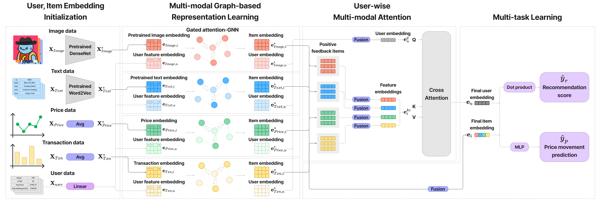

# [EAAI] Multi-attention recommender system for non-fungible tokens

 > Official implementation of "**[Multi-attention recommender system for non-fungible tokens](https://www.sciencedirect.com/science/article/abs/pii/S095219762401337X)**" ([Engineering Applications of Artificial Intelligence](https://www.sciencedirect.com/journal/engineering-applications-of-artificial-intelligence))"

All experiments were repeated three times, which can be replicated with three different random seeds (2022, 2023, 2024).<br>
<br>
Explore our [Data Description](Data_Description.md) for detailed data information, and [Experimental Details](Experimental_Details.md) for the detailed experiment settings.

[](https://hits.seeyoufarm.com)




## Get started

### **`Our model`**

1. Install Python 3.10.9

2. Download data. You can obtain all pre-processed data from [Google Drive](https://drive.google.com/drive/folders/1p4DQdyTASICL31APiTNoscsUIQ3_WJhf?usp=sharing).
   
   (For detailed description about the data, please refer to `Our model/Create_dataset.ipynb`)

3. Create a directory `dataset/collections` and place the downladed data in that location. 

4. Download requirement packages ***pip install -r requirements.txt***

5. Train the model. 

   We provide the experiment scripts of all datasets in the file `run.sh`. You can reproduce the experiment results by: 

   ~~~bash
   bash run.sh
   ~~~

6. *(Ablation studies)* Train the model using a single graph. 

   In this case, since the multi-modal attention used in the existing NFT-MARS model cannot be applied, the model name has been changed to "MO", which stands for Multi Objective. For example, "MO_v" is a single graph model that utilizes visual features. 

   We provide the experiment scripts of all datasets in the file `run_MO.sh`. You can reproduce the experiment results by:

   ```bash
   bash run_MO.sh
   ```

## Contribution

- We develop a model to address three unique challenges that NFT recommender systems face. Our method consists of three key components:
  1. **Graph attention** to handle extremely sparse user-item interactions
  2. **Multi-modal attention** to incorporate user-specific feature preferences
  3. **Multi-task learning** to address the dual nature of NFTs as artworks and investment assets
- We demonstrate the effectiveness of our model compared to various baseline models using the actual transaction data of NFTs collected directly from blockchain for four of the most popular NFT collections.
- We constructed a dataset by combining this transaction data with hand-crafted features, which can be used as a benchmark dataset for any NFT recommendation model. Datasets are available on [Google Drive](https://drive.google.com/drive/folders/1p4DQdyTASICL31APiTNoscsUIQ3_WJhf?usp=sharing).

## Baselines

Our repository includes two additional folders: "**Baseline models (MGAT)**" and "**Baseline models (Others)**". All baselines except for MGAT were implemented using RecBole, so they are separated into their own folder.

### **`Baseline models (MGAT)`**

contains the code to implement the MGAT model.

You can follow the steps in the "Get started" section above, but note that the experiment script names are different. 

```bash
bash run_MGAT.sh
```

### **`Baseline models (Others)`**

contains code to implement other models including Pop, ItemKNN, BPR, DMF, LightGCN, FM, DeepFM, WideDeep, DCN, and AutoInt. 

You can follow the steps in the "Get started" section above, but note that you need to install different version of Python. 

```
Python 3.7.12
```

## Acknowledgement

We appreciate the following github repos a lot for their valuable code base or datasets:

1. [RecBole](https://github.com/RUCAIBox/RecBole)
2. [MGAT](https://github.com/zltao/MGAT)
